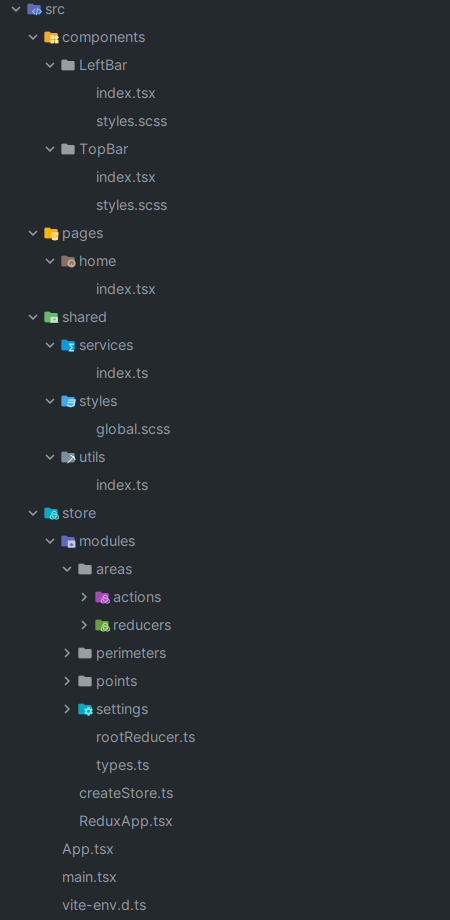

<div align="center">
<h1 align="center">Nimbus</h1>
</div>

## Antes de começar:

Algumas informações importantes serão passadas nesse trecho:

- Foi utilizado o [React](https://react.dev/) + [Vite](https://vitejs.dev/guide/) CLI para o desenvolvimento do
  aplicativo.


- Foi utilizado o [JSON Server](https://www.npmjs.com/package/json-server?activeTab=readme#json-server-) para expor a
  API localmente.
  <br>
  será necessário iniciar o json-server e executar o comando abaixo para expor a API localmente.
  <br>

    json-server --watch db.json --port 3333

certifique-se de que o json-server está rodando na porta 3333 ou em alguma porta de preferência.
<br>

- Foi utilizado o [Redux](https://redux.js.org/) para gerenciar o estado da aplicação.

- ### A imagem abaixo mostra o fluxo de telas da aplicação:



## Executando o projeto react native:

Para executar o projeto react-native, siga os passos abaixo:

1. Clone o repositório:
    ```sh
    git clone https://github.com/miguelwiest/nimbus-vaga.git
    ```
2. Instale as dependências:
    ```sh
    npm install
    ```
   ou
     ```sh
    yarn
    ```
4. Execute o projeto:
    ```sh
    vite
    ```
   ou
    ```sh
    npm run dev
    ```
   ou
    ```sh
    yarn dev
    ```

## Executando o API local:

Para executar a API local, siga os passos abaixo:

1. Execute este comando:
    ```sh
    json-server --watch db.json --port 3333
    ```
    ou
     ```sh
    npm run json-server
    ```
    ou
     ```sh
    yarn json-server
    ```